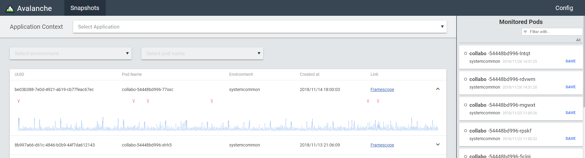
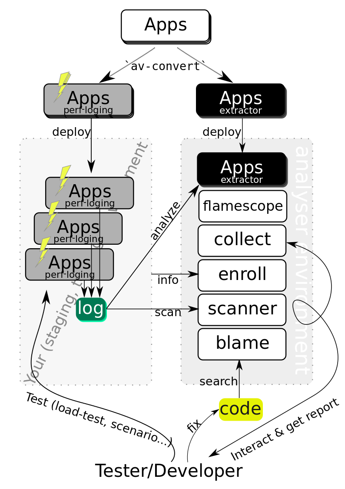

[](https://travis-ci.com/WorksApplications/Avalanche)

# Avalanche - Manage and explore perf logs and source code

Avalanche is a new open-source set of service & tool to manage, examine and visualize performance logs generated by `perf-tools`.

To grasp looks & usage, see our wiki page: [About Avalanche view](https://github.com/WorksApplications/Avalanche/wiki/About-Avalanche-view).



## Concept

1. Applications emit pre-recorded performance logs using `perf-tools`.
1. Take log snapshot on-demand (eg. on incident response).
1. Explore the performance snapshots and find bottlenecks.



## How it works

### Brief summary

1. Transform your application's container image to "perf-enabled" image and "extractor" image with `provide` tool in this repository
1. Deploy "perf-enabled" image on your environment
1. Write configurations regarding your target environment, log server and search engine.
1. Run

## Requirements

Hence we have started to develop this tool for internal use, the target environment (application environment) has several prerequisite.
Additionally, this tool must be deployed with several runtime dependencies (eg. MySQL).

### Build dependencies

- go
- java
- yarn (and node, webpack)
- wget (or fetch, curl...etc)

### Target dependencies

- containered apps - This tool requires a container for generating performance observation images.
- log server - The log server exposes applications' log directories; currently, we supports nginx or local disk.

### Runtime dependencies
- [flamescope](https://github.com/Netflix/flamescope)
- MySQL (or MariaDB. Our team uses Maria actually)
- storage - We store some data in a disk; if you run this server in kubernetes, you have to provide persistentVolume.
- code search engine - a search engine for your repository must be provided to suggest a bottleneck code.
- kubernetes - This tool is built for kubernetes-hosted apps and most of our terminology in both aspect of API and example follows kubernetes naming.
- kustomize - Not only target is assumed to be hosted in kubernetes, our service itself can be hosted in kubernetes. We provide kustomize template.

## Included Components

- extractor: Create a image to retrieve and convert `perf` output
- collect: Create, keep and manage all _snapshot_s extracted from perf logs
- scanner: Crowl and scan log server and find perf log
- suspect: Guess code-path by using code search engine and flamescope
- front: Frontend view to show snapshot list and start collecting analysis result.

## Build binary

```
% wget http://central.maven.org/maven2/io/swagger/swagger-codegen-cli/2.4.0/swagger-codegen-2.4.0.jar -O swagger-codegen-cli.jar
% make dep
% export API_BASE_URL=http://avalanche.your.network/api
% make
```

## Deploy

### Common preparation

1. Set up your MySQL server. Note that `collect` has an option `--init` to instruct it to initialize your database.
1. Deploy `flamescope` to your analysis server.

### To kubernetes

1. Edit (by your editor or `envsubst`) deployment/kustomize/template/template.yaml to make it matches with your configuration.
1. Place it on deployment/kustomize/.../.
1. Run `kustomize` to generate kubernetes configuration and feed it to `kubectl`. Note that `flamescope` isn't included in the default configuration.

```
% export DB_CRED_USER=duke
% export DB_CRED_PASS=duke's!password
% export :
% export :
% export : # see the file
% envsubst < deployment/kustomize/template/template.yaml > deployment/kustomize/overlays/devel/generated.yml
% kustomize build deployment/kustomize/overlays/devel | kubectl apply -f -

```

### To docker-compose

## Development

### Backend

### Frontend (Avalanche view)

Before you start developing, download [openapi-generator](https://github.com/openapitools/openapi-generator) jar file to git root directory and generate API clients by `make openapi-client-gen` or equivalent command.  

When you develop components with Storybook, run `yarn run storybook`.

When you develop the pages, run like `yarn run start --env.COLLECT_API_BASE=http://localhost:5001 --env.BLAME_API_BASE=http://localhost:5002 --env.FLAMESCOPE_API_BASE=http://localhost:5003`. (These `API_BASE` params are optional but recommended to specify on your local.)  
If you want to use mock server for it, generate mock server files by `make openapi-mock-gen` or equivalent command. Note that "cors" module might be required for express server.

When you build the pages, execute like `yarn run build --env.COLLECT_API_BASE=http://localhost:5001 --env.BLAME_API_BASE=http://localhost:5002 --env.FLAMESCOPE_API_BASE=http://localhost:5003`

TSLint, stylelint and Prettier are enabled. Configure your editor or IDE for them.

## Trivia

The name, Avalanche, is an analogy standing for that solving an underlaying hardened bottleneck results in super fast move of gigantic pile of stacks.
