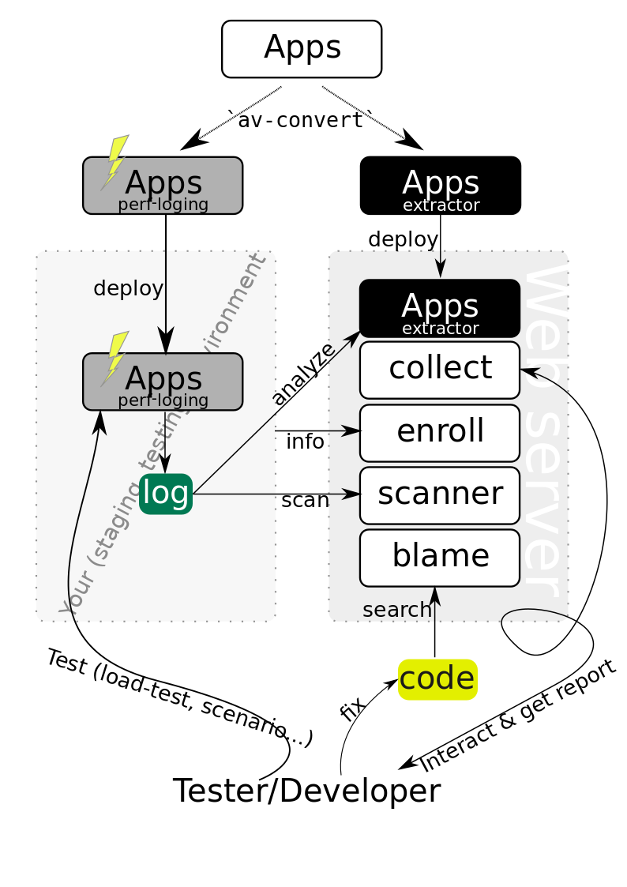

# Avalanche - Manage and explore perf logs and source code

Avalanche is a new open-source set of service & tool to manage, examine and visualize performance logs generated by `perf-tools`.

## Concept

1. Application emits performance logs using `perf-tools`.
1. Analyze the log on-demand.



## How it works

### Setup briefing

1. Transform your application's container image to "perf-enabled" image and "extractor" image with `provide` tool in this repository
1. Deploy "perf-enabled" image on your environment
1. Write configurations regarding your target environment, log server and search engine.
1. Run

## Requirements

### Build

- go
- java
- swagger
- yarn

### Target

- containered apps - This tool requires a container for generating performance observation images.

### Runtime dependencies
- [flamescope](https://github.com/Netflix/flamescope)
- MySQL
- Storage - We store some data in a disk; if you run this server in kubernetes, you have to provide persistentVolume.
- code search engine - a search engine for your repository must be provided to suggest a bottleneck code.
- kubernetes - This tool is built for kubernetes-hosted apps and most of our terminology in both aspect of API and example follows kubernetes naming.
- kustomize - Not only target is assumed to be hosted in kubernetes, our service itself can be hosted in kubernetes. We provide kustomize template.

## Components

- extractor: Create a image to retrieve and convert `perf` output
- collect: Create, keep and manage all _snapshot_s extracted from perf logs
- scanner: Crowl and scan log server and find perf log
- suspect: Guess code-path by using code search engine and flamescope
- front: Frontend view to show snapshot list and start collecting analysis result.

## Build binary

```
make
```

## Deploy

## Trivia

The name, Avalanche, is an analogy standing for that solving an underlaying hardened bottleneck results in super fast move of gigantic pile of stacks.
